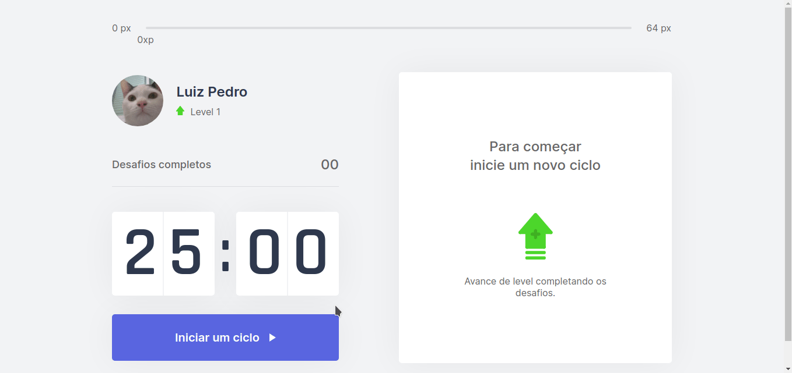
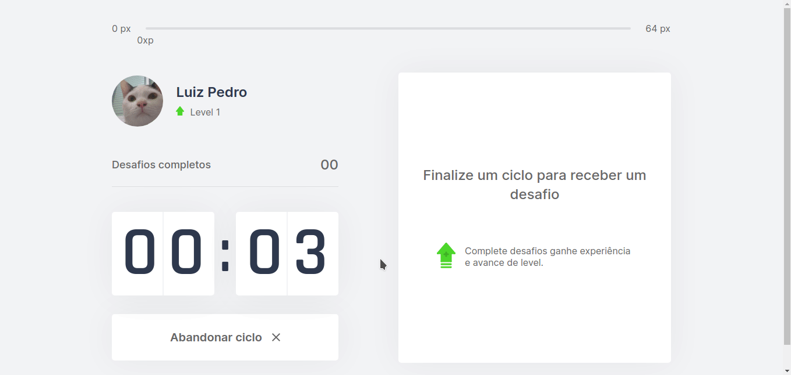

<h1 align="center">
  
  <br>
  <a href="https://github.com/LuizPedroSousa/Moveit/issues">
    
  </a>
  <a href="https://github.com/LuizPedroSousa/Moveit/stargazers">
    
  </a>
  <a href="https://github.com/LuizPedroSousa/Moveit/network">
    
  </a>
</h1>

<p align="center">
  <a href="#page_facing_up-sobre">Sobre</a>&nbsp;&nbsp;&nbsp;|&nbsp;&nbsp;&nbsp;<a href="#closed_book-instalação">Instalação</a>&nbsp;&nbsp;&nbsp;|&nbsp;&nbsp;&nbsp;<a href="#-tecnologias">Tecnologias</a>&nbsp;&nbsp;&nbsp;|&nbsp;&nbsp;&nbsp;<a href="#clipboard-road-map">Road map</a>&nbsp;&nbsp;&nbsp;|&nbsp;&nbsp;&nbsp;<a href="#man-author">Author</a>
</p>

<p align="center">
  
  &nbsp;
  
</p>
<br/>

## :page_facing_up: Sobre

Move.it é um app que usa a técnica de pomodoro e é voltado para devs ou para pessoas que passam muito tempo na frente do computador. O app te estimula a fazer exercícios físicos e oculares, termine um "ciclo" e ganhe desafios completando desafios você ganha experiência e sobe de nível!

<br/>

## :closed_book: Instalação

### Pré-Requisitos

#### Para rodar este projeto você vai precisar das seguintes ferramentas:

- <a href="https://git-scm.com/downloads">
    Git 
  </a>
- <a href="https://nodejs.org/pt-br/">
    Node 
  </a>
- <a href="https://www.npmjs.com/">Npm </a>
- ou <a href="https://yarnpkg.com/getting-started/install">Yarn </a>
- E um bom editor de código como o
  <a href="https://code.visualstudio.com/">
  VsCode 
  </a>

### Rodando

```bash

# Clone este repositório
$git clone https://github.com/LuizPedroSousa/Moveit.git

# Entre na pasta
$cd ./Moveit

# Instale as dependências
$npm install

# E inicie o projeto!
$npm dev

```

<br/>

## 🛠 Tecnologias

- <a href="https://nextjs.org/">
  Next-Js 
  </a>

- <a href="https://reactjs.org/">
  React-Js 
  </a>

- <a href="https://styled-components.com/">
  Styled-Components 
  </a>

- <a href="https://www.mongodb.com/">
  Mongodb 
  </a>

- <a href="https://www.typescriptlang.org/">
  TypeScript 
  </a>

<br/>

## :clipboard: Road map

- [ ] Página de ciclos
  - [x] Iniciar um ciclo de 25 minutos.
  - [x] Abandornar ciclo.
  - [x] Dispara uma notificação com som ao terminar um ciclo
  - [x] A cada ciclo libera um novo desafio aleatório.
  - [x] Usuário ganha XP a cada desafio concluído.
  - [x] Usuário pode subir de nível.
  - [ ] Dispara um som ao subir de nivel
  - [ ] Dispara um som ao completar desafio
  - [ ] Botão para compartilhar no twitter
- [ ] Página de ranking
- [ ] Página de login
  - [ ] Authenticação
    - [ ] OAuth do GitHub
    - [ ] Login por email
- [ ] Serverless com mongodb
- [ ] Dark-mode
- [ ] Asidebar para navegar entre as telas

<br/>

## :man: Author

<a href="https://github.com/LuizPedroSousa">
  
  <br/>
</a>
<p>Feito com 💜 por <a href="https://github.com/LuizPedroSousa">Luiz Pedro</a> 😸 Entre em contanto!</p>

[](mailto:luizpedrosousa64@gmail.com)
